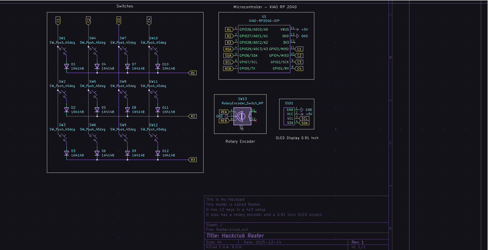
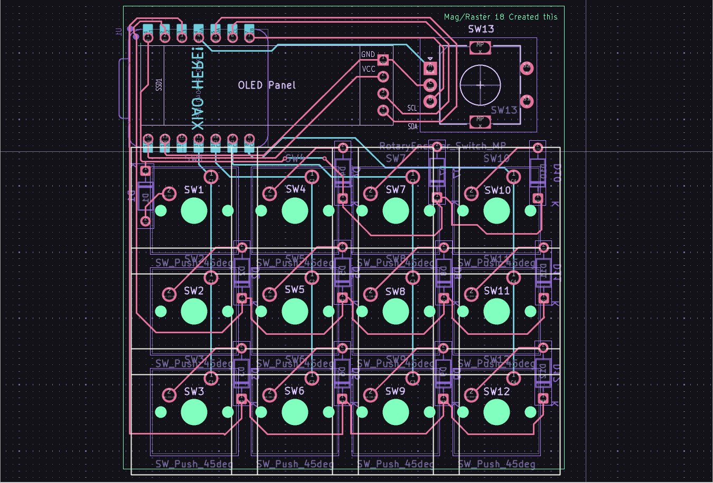
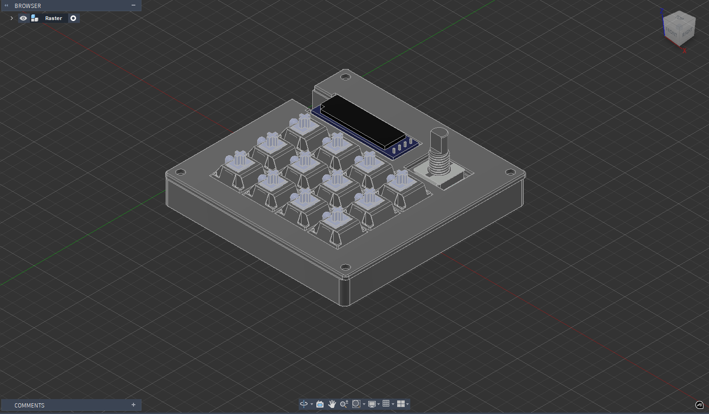

Hello!
This is Mag and I created this Raster Macropad!

========
- Raster is a macropad having a layout of 4x3, a rotary encoder and an Oled Screen.

Lets go through the Screenshots of Raster to get a better understanding it (also to get authorised by blueprint!)

Firstly the screenshot of the schematic of Raster Macropad 

Then next comes the PCB

Now comes the case!

And finally the full image!

And those are all the images!

Now time for all the componenets used!

BOM - 1. Seeed XIAO RP 2040
      2. 1N4148 Diodes
      3. MX-style switches (cherry)
      4. EC11 Rotary encoder
      5. 0.91 inch OLED display - SSD 1306 - 
      6. Blank DSA keycaps
      7. M3x16mm screws
      8. M3x5mx4mm screws
      9. 3D printed Case

Thats everything!

If you cant access the screenshots, I've included all the screenshots in the attributes folder!